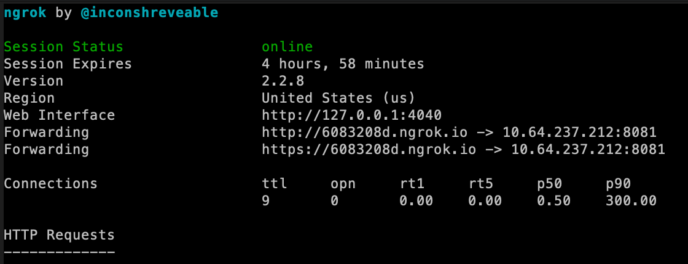

# Chat-ops Dispatch demo

This guide walks through creation of a chat-ops integration with Slack using Dispatch.  Specifically we will be creating
slack commands for interacting with different clouds.

## Running in Fusion/Workstation

If running this demo locally, you will need to create a tunnel so that slack can reach back to your VM and call Dispatch.  [ngrok](https://ngrok.com/) is a great tool for setting up quick tunnels for demos and development.  Using ngrok, simply create a tunnel to the Dispatch API gateway with the following command:

```bash
ngrok http <VM IP>:8081
```

Use the https forwarding address when creating the cloudmaster slash command below.




## Create Slack Incoming Webhook

The incoming webhook will be used to asynchronously post status updates to a particular slack channel.  The
setup is pretty straightforward.

[https://api.slack.com/incoming-webhooks](https://api.slack.com/incoming-webhooks)

Select a channel to post messages to, then store the URL from the incoming web hook in `slack.json`:

```json
{
  "statusUrl": "https://hooks.slack.com/services/********"
}
```

Now, let's go ahead and store the secret in Dispatch:

```
dispatch create secret slack slack.json
```

## Create Slack Slash Command

Next we use a slack slash comand to issue "cloudmaster" commands.  Setup again should be pretty straightforward.

[https://api.slack.com/slash-commands](https://api.slack.com/slash-commands)

This demo assumes that the command is `/cloudmaster`.  The URL is the Dispatch API gateway hostname or IP address plus
the path of the API endpoint we will create later.  For internal integrations, certificates are not required (See
[Appendix](#appendix-using-lets-encrypt-with-dispatch) to find out how to use Let's Encrypt with Dispatch).

If you are using ngrok, the url will look similar to:
```
https://6083208d.ngrok.io/dispatch-server/cloudmaster
```

Otherwise:
```
https://<API GATEWAY HOSTNAME>/dispatch-server/cloudmaster
```
Also for method, choose `POST`.  The rest of the configuration is mostly informational.  Configure as you like.

## Configuring Cloudmaster

The cloudmaster function that we create later will need the a URL to connect back to the Dispatch API server.  Because
the function is running in a docker container simply using `http://localhost:8080` does not work.  Instead use the
internal IP address used by the host.  For Linux/OVA deployments:

```json
{
  "url": "http://172.17.0.1:8080"
}
```

If running natively on mac:

```json
{
  "url": "http://host.docker.internal:8080"
}
```

## Creating Cloud Secrets
Our demo will use credentials for different clouds. Dispatch uses secrets to store them separately from your code, and injects them
when the function is executed. We need to create following secrets for this demo (if you are not using all the clouds, skip the respective secrets):

#### AWS
Create a JSON file `aws.json` with following contents:
```json
{
  "access_key": "<access_key>",
  "secret_key": "<secret_key>",
  "region": "us-west-2"
}
```
adjust the values to your environment. Then run:
```bash
dispatch create secret aws aws.json
```

#### Azure
Create a JSON file `azure.json` with following contents:
```json
{
    "clientId": "<UUID>",
    "password": "<UUID>",
    "tenant": "<UUID>",
    "subscription": "<UUID>",
    "admin_password": "<Password for admin account within a VM>",
    "location": "<Azure region, e.g. eastus2>",
    "subnet": "<name of the subnet to connect VM to>",
    "virtual_network": "<name of the virtual network where the subnet resides>"
}
```
adjust the values to your environment. Then run:
```bash
dispatch create secret azure azure.json
```

#### GCP
Create a JSON file `gcp.json` with following contents:
```json
  "type": "service_account",
  "project_id": "<project_id>",
  ... Other service account credentials, as included in the JSON file downloaded from GCP IAM.
  "zone": "us-west1-c"
```
adjust the values to your environment. Then run:
```bash
dispatch create secret gcp gcp.json
```

#### vSphere
Create a JSON file `vsphere.json` with following contents:
```json
{
  "host": "vCenter URL",
  "datacenter": "SDDC-Datacenter",
  "resourcePool": "Compute-ResourcePool",
  "vmFolder": "Workloads",
  "username": "<username>",
  "password": "<password>"
}
```
adjust the values to your environment. Then run:
```bash
dispatch create secret vsphere vsphere.json
```

## Creating Seed Images
Dispatch comes with few images that are pre-configured for most common use cases. Base Images bring support for different
programming languages, where as Images build upon them, adding system and runtime dependencies. Run
```bash
dispatch create seed-images
```

to create images for python, java, nodejs and powershell. We will utilize those images below.


## Creating Resources
This demo is using multiple resources. You can create them individually (for example, if you are not using one of the clouds).
If you want to create all of them, run `dispatch create -f all-resources.yaml`. This will create all base images, images,
functions, API definitions, event drivers and subscriptions used in the demo.

## Check the Slash Command Payload

This step is purely optional, but it's a good way of using a function (echo) to validate the payload information passed
to a function.  This is helpful when dealing with 3rd party services which may or may not have good API documentation.

Use an echo function to verify the slash command payload.

```
dispatch create api echo echo --path /cloudmaster --method POST --https-only
```

Execute the slash command

```
/cloudmaster create myvm on aws
```

If successful, you should see a nice little reply in slack.  However what we really are after is the full function
result.  The below command (without a run ID) will print the results of ALL echo runs.  You may want to omit the
`--json` flag to get a list of all the runs first... then pick the latest one.

```
dispatch get runs echo [run ID] --json
{
    ...
    "output": {
        "channel_id": "********",
        "channel_name": "privategroup",
        "command": "/cloudmaster",
        "context": {
            "httpContext": {
                "accept": "application/json,*/*",
                "accept-encoding": "gzip,deflate",
                "args": "functionName=echo",
                "content-length": "340",
                "content-type": "application/x-www-form-urlencoded",
                "cookie": "cookie",
                "host": "*********.example.com",
                "method": "POST",
                "request": "POST /cloudmaster HTTP/1.1",
                "request-uri": "/cloudmaster",
                "scheme": "https",
                "server-protocol": "HTTP/1.1",
                "upstream-uri": "/v1/runs",
                "uri": "/cloudmaster",
                "user-agent": "Slackbot 1.0 (+https://api.slack.com/robots)"
            },
            "secrets": {},
            "serviceBindings": {}
        },
        "enterprise_id": "********",
        "enterprise_name": "Example.com",
        "response_url": "https://hooks.slack.com/commands/********",
        "team_domain": "example",
        "team_id": "********",
        "text": "echo",
        "token": "********",
        "user_id": "********",
        "user_name": "********"
    },
    ...
}
```

Since we're done with this, let's delete our API endpoint we are going to assign a new api to the same path later:

```
dispatch delete api echo
```

## Create some VMs!

We are now ready to create VMs.  If everything is correct creating a vm on GCP is a simple as:

```
/cloudmaster create vmtest01 on gcp
```


## What's next?

This should be a good introduction into a chat-ops workflow.  This example could be extended in a lot of different
ways to add new commands and functionality.


### Appendix: Using Let's encrypt with Dispatch

If you would like to use properly signed certificate with Dispatch, you can do that using `certbot`. Install certbot
using [official instructions](https://certbot.eff.org/docs/install.html), and then run:

```
certbot certonly --standalone -d dispatch.example.com
```
to obtain the certificate. Then run dispatch server using following flags:

```
--enable-tls --tls-certificate /etc/letsencrypt/live/dispatch.example.com/fullchain.pem --tls-certificate-key /etc/letsencrypt/live/dispatch.example.com/privkey.pem
```

In both commands replace `dispatch.example.com` with your domain.