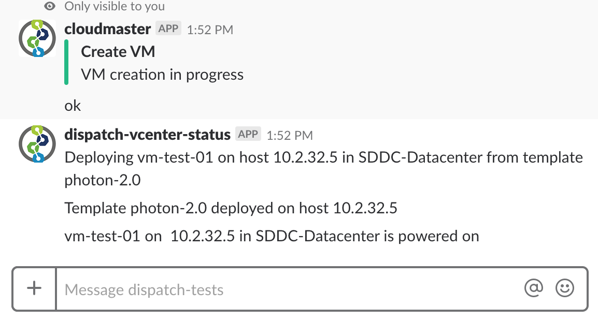

# Radio Dispatch Demo

This guide walks through creation of a chat-ops integration with Slack using Dispatch.  Specifically we will be creating
slack commands for interacting with VMware vCenter.

## Create Slack Incoming Webhook

The incoming webhook will be used to asynchronously post vCenter status updates to a particular slack channel.  The
setup is pretty straightforward.

[https://api.slack.com/incoming-webhooks](https://api.slack.com/incoming-webhooks)

Select a channel to post messages to.  Then record the webhook URL.  We will use this shortly.

## Create Slack Slash Command

Next we use a slack slash comand to issue "cloudmaster" commands.  Setup again should be pretty straightforward.

[https://api.slack.com/slash-commands](https://api.slack.com/slash-commands)

This demo assumes that the command is `/cloudmaster`.  The URL is the Dispatch API gateway hostname or IP address plus
the path of the API endpoint we will create later.  For internal integrations, certificates are not required.

It should look something like `https://api-dispatch.example.com/cloudmaster`.  Also for method, choose `POST`.  The
rest of the configuration is mostly informational.  Configure as you like.

Store the token and the URL from the incoming web hook in `slack.json`:

```json
{
  "token": "*********",
  "statusUrl": "https://hooks.slack.com/services/********"
}
```

Now, let's go ahead and store the secret in Dispatch:

```
dispatch create secret slack slack.json
```

## Check the Slash Command Payload

This step is purely optional, but it's a good way of using a function (echo) to validate the payload information passed
to a function.  This is helpful when dealing with 3rd party services which may or may not have good API documenation.

Use an echo function to verify the slash command payload.

```
dispatch create function echo echo.js --image nodejs6
dispatch create api echo echo --path /cloudmaster --method POST --https-only
```

Execute the slash command

```
/cloudmaster create vm with prod
```

If successful, you should see a nice little reply in slack.  However what we really are after is the full function
result.  The below command (without a run ID) will print the results of ALL echo runs.  You may want to omit the
`--json` flag to get a list of all the runs first... then pick the latest one.

```
dispatch get runs echo [run ID] --json
{
    ...
    "output": {
        "channel_id": "********",
        "channel_name": "privategroup",
        "command": "/cloudmaster",
        "context": {
            "httpContext": {
                "accept": "application/json,*/*",
                "accept-encoding": "gzip,deflate",
                "args": "functionName=echo",
                "content-length": "340",
                "content-type": "application/x-www-form-urlencoded",
                "cookie": "cookie",
                "host": "*********.example.com",
                "method": "POST",
                "request": "POST /cloudmaster HTTP/1.1",
                "request-uri": "/cloudmaster",
                "scheme": "https",
                "server-protocol": "HTTP/1.1",
                "upstream-uri": "/v1/runs",
                "uri": "/cloudmaster",
                "user-agent": "Slackbot 1.0 (+https://api.slack.com/robots)"
            },
            "secrets": {},
            "serviceBindings": {}
        },
        "enterprise_id": "********",
        "enterprise_name": "Example.com",
        "response_url": "https://hooks.slack.com/commands/********",
        "team_domain": "example",
        "team_id": "********",
        "text": "echo",
        "token": "********",
        "user_id": "********",
        "user_name": "********"
    },
    ...
}
```

Since we're done with this, let's delete our API endpoint we are going to assign a new api to the same path later:

```
dispatch delete api echo
```

## Create a Service Account on Dispatch

In order to call the Dispatch API from within a function, we need a service account.  You can read about service
accounts in depth [here](https://vmware.github.io/dispatch/documentation/guides/setup-service-acccount-authentication).
We'll just give you the quick and dirty steps.

Create an RSA key pair:

```
openssl genrsa -out cloudmaster.key 4096
openssl rsa -in cloudmaster.key -pubout -outform PEM -out cloudmaster.pub
```

Use the public key to create a service account:

```
dispatch iam create serviceaccount cloudmaster --public-key ./cloudmaster.pub
dispatch iam create policy all-access --subject cloudmaster --action "*" --resource "*" --service-account cloudmaster
```

We are going to generate a JWT and store as a secret which the function can use.  We're using a little python helper
script.  It depends on the pyjwt library (this will be built into the Dispatch CLI soon).  The script actually
generates a secret which includes the API gateway url:

```
# The API GATEWAY_HOST will be unique for your installation
export API_GATEWAY_HOST=api-dispatch.example.com
python gen_jwt.py cloudmaster ./cloudmaster.key 30 $API_GATEWAY_HOST
Dispatch secret cloudmaster.json
```

Store the secrets to be used by Dispatch.  This secret contains the service account key that functions can use in
order to issue reqests against the Dispatch API:

```
dispatch create secret cloudmaster-sa cloudmaster.json
```

## Register the Cloudmaster Function

The cloudmaster function is a router to sub-functions which do the work according to the command.  Note that we are
passing 2 secrets to the function.  The contents of these secrets are injected into the function context at invocation
time.

```
dispatch create function cloudmaster cloudmaster.py --image python3 --secret cloudmaster-sa --secret slack
```

Create the /cloudmaster API endpoint:

```
dispatch create api post-cloudmaster cloudmaster --path /cloudmaster --method POST --https-only
```

The slack slash command should already be set to the correct URL endpoint if you've followed this guide exactly.  It's
probably a good idea to doublecheck that the set endpoint is `https://$API_GATEWAY_HOST/cloudmaster`.

Validate the echo command through cloudmaster.

```
slack: /cloudmaster echo hello everyone!
```

## Register the Clone VM Function

Create the `vcenter.json` secret which contains the credentials to vCenter running on VMC.  This secret will be used
both by the `clone-vm` function and the vCenter event driver (hence some duplication with the `vcenterurl`):

```json
{
  "host": "vcenter.********.vmc.vmware.com",
  "datacenter": "SDDC-Datacenter",
  "resourcePool": "Compute-ResourcePool",
  "vmFolder": "Workloads",
  "username": "********@vmc.local",
  "password": "********",
  "vcenterurl": "********@vmc.local:********@vcenter.********.vmc.vmware.com:443"
}
```

```
dispatch create secret vcenter ./vcenter.json
```

Before we create the `clone-vm` function, we need to create a Dispatch image which contains the required python
dependencies (`pyvmomi` specfically).  Check out `pyvmomi.txt` to see all the required dependencies:

```
dispatch create image python3-pyvmomi python3-base --runtime-deps pyvmomi.txt
```

Check the image state to make sure it's created successfully:

```
$ dispatch get image
       NAME       | URL |    BASEIMAGE    | STATUS |         CREATED DATE
---------------------------------------------------------------------------------
  python3         | ... | python3-base    | READY  | Sat Jan  1 09:56:52 PST 0000
  powershell      | ... | powershell-base | READY  | Sat Jan  1 09:56:52 PST 0000
  nodejs          | ... | nodejs-base     | READY  | Sat Jan  1 09:56:52 PST 0000
  python3-pyvmomi | ... | python3-base    | READY  | Sat Jan  1 12:01:14 PST 0000
```

Finally, create the `clone-vm` function:

```
dispatch create function clone-vm clonevm.py --image python3-pyvmomi --secret vcenter
```

## Create a vCenter Event Driver

The vCenter event driver imports events from vCenter and pushes them onto the Dispatch event bus.  At this point,
functions may be subscribed to the particular events.  We are going to use this to push status updates to Slack.

```
dispatch create eventdriver vcenter --name vcenter --secret vcenter
```

Validate the events are being received (this assumes you have kubectl access):

```
dispatch log event-driver-vcenter -f driver
...
time="2018-05-25T20:13:19Z" level=debug msg="got event of type UserLoginSessionEvent"
time="2018-05-25T20:13:19Z" level=debug msg="No dedicated handler"
time="2018-05-25T20:13:20Z" level=debug msg="got event of type UserLogoutSessionEvent"
time="2018-05-25T20:13:20Z" level=debug msg="No dedicated handler"
```

## Subscribe to vCenter Events

The next step is to create the function which will subscribe to the events from the driver. Create a `status` function
which will update a slack channel with vCenter events.  Note that we are passing in the `slack` secret which contains
the status URL pointing to the incoming webhook define at the start:

```
dispatch create function status status.py --image python3-pyvmomi --secret slack
```

Finally, we can subscrive our function to the incoming events:

```
dispatch create subscription status --source-type vcenter --event-type vm.deployed
dispatch create subscription status --source-type vcenter --event-type vm.stopping
dispatch create subscription status --source-type vcenter --event-type vm.removed
dispatch create subscription status --source-type vcenter --event-type vm.powered.on
dispatch create subscription status --source-type vcenter --event-type vm.powered.off
```

Your subscriptions should look similar to:

```
$ dispatch get subscriptions
           NAME          | SOURCE TYPE |   EVENT TYPE   | FUNCTION NAME | STATUS |         CREATED DATE
----------------------------------------------------------------------------------------------------------
  native-troll-352185    | vcenter     | vm.powered.on  | status        | READY  | Sat Jan  1 12:48:45 PST 0000
  willing-cheetah-356512 | vcenter     | vm.removed     | status        | READY  | Sat Jan  1 12:48:44 PST 0000
  touched-foal-822640    | vcenter     | vm.powered.off | status        | READY  | Sat Jan  1 12:48:46 PST 0000
  just-wildcat-236741    | vcenter     | vm.stopping    | status        | READY  | Sat Jan  1 12:48:44 PST 0000
  star-goose-402131      | vcenter     | vm.deployed    | status        | READY  | Sat Jan  1 12:48:39 PST 0000
```

## Create some VMs!

There is one last step before we can actually create VMs.  Within vCenter, create a template(s) to use as a source for
VMs.  This is a bit outside the scope of this guide.  We have created a template called `photon-2.0` which is simply an
PhotonOS 2.0 linux VM.

We are now ready to create VMs.  If everything is correct creating a VM is a simple as:

```
/cloudmaster create vm-test-01 with photon-2.0
```



## What's next?

This should be a good introduction into a chat-ops workflow.  This example could be extended in a lot of different
ways to add new commands and functionality.
